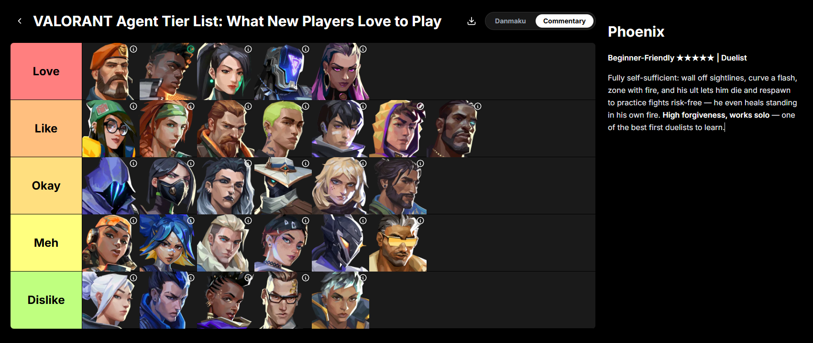

# TierList Maker

A portable Agent Skills plugin that helps a user author a **TierVibe** tier list and produce a `.tiervibe.json` they import at `https://tiervibe.com/t/import`.

The agent does all the work (interview, tiers, cards, explanations) and outputs one local file. Nothing touches the TierVibe server until the user clicks **发布 (Publish)** in the editor — login only comes up at that final import step.

## Demo



**One prompt → a publish-ready TierList, with commentary on every card.**

Ask the agent something like *"make a tier list for AI coding models"* and it runs the whole workflow for you:

1. Interviews the topic and tier count (henz / love / custom presets).
2. Sets up the tiers — names, title-bar colors, the board's global brightness.
3. Drafts every card (text cards with coordinated colors, or image placeholders).
4. Writes a markdown **commentary (讲解)** on each card — the part that makes a tier list worth reading.
5. Emits a single `.tiervibe.json` and points you to `https://tiervibe.com/t/import`.
6. You drag the cards into your final order and hit 发布. Login only happens here, at the last step.

No image hunting, no manual card entry, no blank cards. The agent does the labor; you keep the judgment.

> 一键用 AI 做出带讲解的高质量 TierList:给 agent 一句话(例如「给 AI 编程模型做个 tier list」),它问清题材和层级、设好配色、建好卡片、给每张卡写 markdown 讲解,最后产出一个 `.tiervibe.json`;你打开 tiervibe.com/t/import 导入、拖拽排序、发布即可。登录只在最后这步。

## Repo layout (dual marketplace)

This repo ships **two** marketplace catalogs so the same plugin installs on both Claude Code and Codex/ChatGPT-style agent tools:

```
TierList-Maker/
├── .claude-plugin/
│   └── marketplace.json            # Claude Code marketplace catalog
├── .agents/plugins/
│   └── marketplace.json            # Codex / ChatGPT-style marketplace catalog
├── plugins/
│   └── tierlist-maker/
│       ├── .claude-plugin/
│       │   └── plugin.json         # Claude Code plugin manifest
│       └── skills/
│           └── tierlist-maker/
│               ├── SKILL.md        # the skill (entry point)
│               ├── references/    # data-schema, tier-config, text-cards, explanations, import-flow
│               ├── templates/     # blank / henz-5tier / text-only skeletons
│               ├── examples/      # worked AI-models example
│               └── assets/
│                   └── logo.svg   # TierVibe logo (icon asset)
└── README.md
```

## Install — Claude Code

Add this repo as a marketplace, then install the plugin:

```
/plugin marketplace add edison7009/TierList-Maker
/plugin install tierlist-maker@tiervibe-com
```

Skill auto-loads on triggers like "make a tier list for ...", or invoke as `/tiervibe-com:tierlist-maker`.

## Install — ChatGPT

1. Open ChatGPT → **插件** (Plugins).
2. 右上角点 **「⬇️」**(下载图标).
3. 选 **添加插件市场** (Add plugin marketplace).
4. 粘贴仓库地址:`https://github.com/edison7009/TierList-Maker.git`
5. 确认后,`tierlist-maker` 出现在插件列表,启用即可.

然后在对话里说"给 X 做个 tier list"触发;AI 一步步问你(标题/风格/项),最后自动打开 tiervibe.com 显示榜单,你拖拽排序、发布。

## Install — Codex (CLI)

The repo ships `.agents/plugins/marketplace.json` (Codex schema). Add and enable:

```
codex plugin marketplace add edison7009/TierList-Maker
```

## How it works (the bridge on the TierVibe side)

The TierVibe editor has a local reader at `/t/import` (no server port, no backend, no data-model change). It parses the `.tiervibe.json` client-side, flattens it into the editor's existing load format, reuses `TierDataService.loadCompleteData` (card sizing, text-card protocol, markdown explanations), and hands off to the editor via the existing `location.state.seed` injection path. The user then drags to sort and publishes.

## Icons

Neither marketplace manifest schema has an icon field (verified against the official Claude Code plugin reference and the Codex/Kimi-style marketplace samples). The TierVibe logo ships at `plugins/tierlist-maker/skills/tierlist-maker/assets/logo.svg` as a skill asset; for the marketplace list UI, set the GitHub repo's social preview image to the same logo.

## Scope / non-goals
- Only **creates new** lists via import. Does not edit/delete existing posts.
- No per-tier background — only the single global `bgBrightness` (0..100).
- No image uploading — image URLs in the file are placeholders; the user swaps them in the editor if they want.
