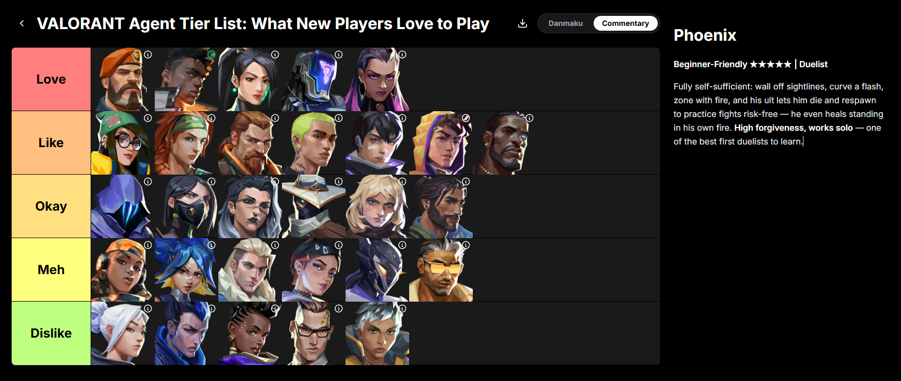

# TierList Maker

One click to a high-quality TierList - colors, text, and images are all customizable.

> 中文版见 [README.zh-CN.md](README.zh-CN.md).

## About

**TierList Maker** helps you build a high-quality tier list on [TierVibe](https://tiervibe.com) — through a step-by-step conversation with an AI agent, not by hand.

- **Per-card commentary.** Every card carries its own markdown explanation — switch cards and the commentary changes. Readers get real reasoning, not just a ranked row.
- **Ask-then-generate.** The agent asks what you want (topic, tier titles, color style) one question at a time, then builds it. No fixed templates — your choices drive the design.
- **Auto-opens the result.** When it's done, the agent opens the finished board in your browser. You log in (only then), drag to sort, publish.
- **Works with the agents you already use** — Claude Code, ChatGPT, Codex, and any agentskills.io-compatible tool.
- **Local until you publish.** Nothing touches the TierVibe server until you click Publish.

## Demo



**One prompt → a publish-ready TierList, with commentary on every card.**

Ask the agent something like *"make a tier list for AI coding models"* and it runs the whole workflow for you:

1. Interviews the topic, tier count, and card mode (text or image).
2. Sets up the tiers — names, title-bar colors, the board's global brightness. For local images, capable agents embed them as `data:image/...` cards; you do **not** need to upload them to a public image host.
3. Drafts every card (text cards with coordinated colors, public image URLs, or embedded local images when the agent can read the files).
4. Writes a markdown **commentary** on each card — the part that makes a tier list worth reading.
5. Emits a single `.tiervibe.json` and opens `https://tiervibe.com/t/import` with the board loaded.
6. You drag the cards into your final order and hit Publish. Login only happens here, at the last step.

No image hunting, no manual card entry, no blank cards. The agent does the labor; you keep the judgment.

## Case study — turn any reference page into a tier list

You don't have to start from a blank topic. Hand the agent a **reference page** and it builds the board from that source.

**Example: a 2026 running-shoe list for the Hruska Clinic.**

1. **Install the skill** (see above), then pick a source you want to tier. For this example, the Hruska Clinic shoe list: `https://www.hruska-clinic.com/shoe-list/`.
2. **Select the TierList-Maker skill** and feed it the reference — paste the URL (or drop the saved page as a file) into the conversation.
3. **Say what you want**, e.g.:
   > Make me a 2026 running-shoe tier list for the well-known American Hruska Clinic, with detailed commentary on every card.
4. **The agent does the rest** — reads the reference, decides the tiers, fills in every shoe as a card, and writes a markdown commentary on each one explaining *why* it sits in that tier.
5. **It auto-opens the result** in your browser at `/t/import`. You drag to sort and publish. Login only happens at that last step.

Real results from this exact prompt:

- English board → https://tiervibe.com/t/GqqVt2jAX1
- 中文版榜单 → https://tiervibe.com/t/Htluzu9Trq

No manual card entry, no blank cards, no copy-paste from the source — the agent turns the reference page into a readable, commentary-rich tier list end to end.

## Repo layout (dual marketplace)

This repo ships **two** marketplace catalogs so the same plugin installs on both Claude Code and Codex/ChatGPT-style agent tools:

```
TierList-Maker/
├── .claude-plugin/
│   └── marketplace.json            # Claude Code marketplace catalog
├── .agents/plugins/
│   └── marketplace.json            # Codex / ChatGPT-style marketplace catalog
├── plugins/
│   └── tierlist-maker/
│       ├── .claude-plugin/
│       │   └── plugin.json         # Claude Code plugin manifest
│       ├── .codex-plugin/
│       │   └── plugin.json         # Codex plugin manifest (with logo)
│       └── skills/
│           └── tierlist-maker/
│               ├── SKILL.md        # the skill (entry point)
│               ├── references/    # data-schema, tier-config, text-cards, explanations, import-flow
│               ├── templates/     # blank / henz-5tier / text-only skeletons
│               ├── examples/      # worked AI-models example
│               └── assets/
│                   └── logo.svg   # TierVibe logo (icon asset)
└── README.md
```

## Install — Claude Code

Add this repo as a marketplace, then install the plugin:

```
/plugin marketplace add edison7009/TierList-Maker
/plugin install tierlist-maker@tiervibe-com
```

Skill auto-loads on triggers like "make a tier list for ...", or invoke as `/tierlist-maker:tierlist-maker`.

(Plugin skills are namespaced by the **plugin** name, not the marketplace name — the plugin is `tierlist-maker` and its skill directory is `skills/tierlist-maker/`.)

## Install — ChatGPT

1. Open ChatGPT → **Plugins**.
2. Click the **⬇️** icon (top-right).
3. Choose **Add plugin marketplace**.
4. Paste the repo URL: `https://github.com/edison7009/TierList-Maker.git`
5. Confirm; `tierlist-maker` appears in the plugin list — enable it.

Then say "make a tier list for X" in chat to trigger it. The AI asks you step by step (titles / style / items), then auto-opens tiervibe.com with the board loaded — you drag to sort and publish.

## Install — Codex (CLI)

The repo ships `.agents/plugins/marketplace.json` (Codex schema). Add and enable:

```
codex plugin marketplace add edison7009/TierList-Maker
```

## How it works (the bridge on the TierVibe side)

The TierVibe editor has a local reader at `/t/import` (no server port, no backend, no data-model change). It parses the `.tiervibe.json` client-side, flattens it into the editor's existing load format, reuses `TierDataService.loadCompleteData` (card sizing, text-card protocol, markdown explanations), and hands off to the editor via the existing `location.state.seed` injection path. Local image files are embedded as `data:image/...;base64,` by agents that can read files; raw `file:` paths are rejected by browsers, but public image hosting is not required for local-image import. The user then drags to sort and publishes.

## Icons

Neither marketplace manifest schema has an icon field (verified against the official Claude Code plugin reference and the Codex/Kimi-style marketplace samples). The TierVibe logo ships at `plugins/tierlist-maker/skills/tierlist-maker/assets/logo.svg` as a skill asset, and the Codex `.codex-plugin/plugin.json` points `interface.logo` at it. For the marketplace list UI, set the GitHub/GitCode repo's social preview image to the same logo.

## Scope / non-goals
- Only **creates new** lists via import. Does not edit/delete existing posts.
- No per-tier background — only the single global `bgBrightness` (0..100).
- Local image files can be embedded by capable agents as `data:image/...` cards, then uploaded to TierVibe's CDN when you publish. For transparent or semi-transparent local images, capable agents must preserve alpha (WebP/PNG), not flatten to RGB/JPEG; raw `file:` paths still do not work in browser import, but you do not need to upload local files to a public image host just to make them appear.
